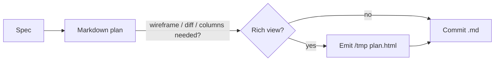
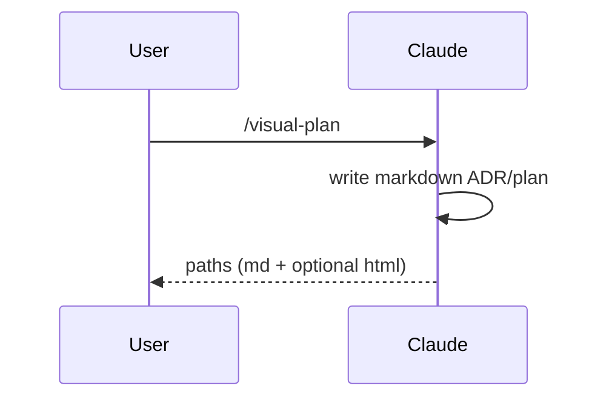

# Block catalog

Copy-paste building blocks for both visual-plan artifacts. Two halves:

- **Part 1 — Markdown-renderable.** These go in the **committed `.md`** (the
  record). They render in Obsidian and GitHub. Reach for HTML only when none of
  these can express the idea.
- **Part 2 — HTML-only.** Presence of any of these is the trigger to **also**
  emit the rich `/tmp/visual-plans/<slug>/plan.html`. Every HTML example here
  uses **only** classes defined in [`../assets/plan.css`](../assets/plan.css) —
  that file is the canonical contract. Never invent a class; add it to
  `plan.css` first, then document it here.

---

# Part 1 — Markdown-renderable (committed `.md`)

### Prose, headings, callouts

Headings and prose as normal. Callouts are blockquotes:

```markdown
> **Note:** reuse `AuthGuard` rather than a second middleware.
> **Warning:** this migration is hard to reverse once data is backfilled.
```

### Mermaid diagram

A fenced `mermaid` block. Renders in Obsidian/GitHub; falls back to readable
source anywhere else. Use for flow, sequence, state, and ER diagrams.

````markdown

````

````markdown

````

### Comparison table

```markdown
| Option | Effort | Reversible | Pick |
|---|---|---|---|
| Inline middleware | Low | Yes | ✅ |
| New service | High | No | — |
```

### Data-model table (always include a **Change** column for recaps)

```markdown
| Field | Type | Change |
|---|---|---|
| `id` | uuid | unchanged |
| `status` | enum | **added** |
| `legacy_flag` | bool | **removed** |
```

### API-summary table

```markdown
| Method | Path | Auth | Notes |
|---|---|---|---|
| GET | `/v1/plans/:id` | session | returns markdown |
| POST | `/v1/plans` | session | creates a plan |
```

### File-tree (nested list)

```markdown
- `src/`
  - `auth/`
    - `guard.ts` — **modified**
    - `session.ts`
  - `routes/plans.ts` — **new**
```

### Fenced code and task lists

```markdown
- [x] Write the markdown plan
- [ ] Emit rich HTML (only if a UI/diff block is needed)
```

---

# Part 2 — HTML-only (rich `/tmp` view)

## Page skeleton

Self-contained: inline the **full** contents of `assets/plan.css` into the
`<style>` block (do not link it — the file must stand alone), and load mermaid
from the pinned CDN ES module. Diagrams are `<pre class="mermaid">` so the
source stays readable if the CDN is unreachable.

```html
<!doctype html>
<html lang="en">
<head>
  <meta charset="utf-8">
  <meta name="viewport" content="width=device-width, initial-scale=1">
  <title>Plan — &lt;slug&gt;</title>
  <style>
  /* >>> paste the entire contents of assets/plan.css here <<< */
  </style>
</head>
<body>
  <main class="plan">
    <h1>&lt;Title&gt;</h1>
    <p class="meta">Plan · 2026-06-19</p>

    <!-- markdown-equivalent prose/tables/callouts as normal HTML, plus any
         HTML-only blocks below -->

    <pre class="mermaid">
flowchart LR
  A[Start] --> B[End]
    </pre>
  </main>

  <script type="module">
    import mermaid from 'https://cdn.jsdelivr.net/npm/mermaid@11.15.0/dist/mermaid.esm.min.mjs';
    mermaid.initialize({ startOnLoad: true });
  </script>
</body>
</html>
```

> **Pin discipline:** always the exact `mermaid@11.15.0` — never a floating
> `@11` tag. Verified 2026-06-19: HTTP 200 with `access-control-allow-origin: *`,
> so the `file://` import works. To bump, see `../CLAUDE.md`.

## Callout

The HTML form of a blockquote callout — default (accent), warning, or note.

```html
<div class="callout">A default info note.</div>
<div class="callout warn">Warning: this migration is hard to reverse.</div>
<div class="callout note">Note: reuse AuthGuard rather than a new middleware.</div>
```

## Wireframe

Content-only UI sketch inside one surface preset. **Trigger:** the work changes
or proposes a UI. Primitives: `wf-card`, `wf-row` (horizontal), `wf-col`
(vertical stack), `wf-pill`, `wf-muted`, `button` / `button.primary`.

```html
<div class="wf browser">
  <div class="wf-card">
    <div class="wf-row">
      <strong>Plans</strong>
      <span class="wf-pill">3 open</span>
    </div>
    <div class="wf-col">
      <span class="wf-muted">Pick a plan to view its markdown record.</span>
      <div class="wf-row">
        <button class="primary">New plan</button>
        <button>Import</button>
      </div>
    </div>
  </div>
</div>
```

```html
<div class="wf mobile">
  <div class="wf-card">
    <div class="wf-muted">Today</div>
    <p>Ship auth guard</p>
    <span class="wf-pill">in review</span>
  </div>
</div>
```

**Surface presets** — same `wf-*` content, different frame on the outer `.wf`:

| Class | Frame |
|---|---|
| `wf browser` | browser chrome (traffic-light dots + URL bar) |
| `wf desktop` | titled application window |
| `wf mobile` | 320px phone with a notch |
| `wf popover` | 280px floating card with shadow |
| `wf panel` | right-anchored 340px side rail |

```html
<div class="wf panel">
  <div class="wf-card"><strong>Filters</strong></div>
  <div class="wf-card wf-muted">Right-anchored side rail.</div>
</div>
```

## Annotated split-diff

Two columns, before | after, with line tints and an optional reason note.
**Trigger:** a code change worth showing side-by-side.

```html
<div class="diff">
  <div class="diff-pane before">
    <span class="diff-ctx">function guard(req) {</span>
    <span class="diff-del">  return true;</span>
    <span class="diff-ctx">}</span>
  </div>
  <div class="diff-pane after">
    <span class="diff-ctx">function guard(req) {</span>
    <span class="diff-add">  return hasSession(req);</span>
    <span class="diff-ctx">}</span>
  </div>
  <div class="diff-note">Stub always-allow replaced with a real session check.</div>
</div>
```

## Before / after columns

Labeled two-up for prose or sketches (not line-level code). **Trigger:** a
conceptual before→after that isn't a literal diff.

```html
<div class="columns">
  <div class="col">
    <div class="col-label">Before</div>
    <p>Plans lived only in chat; nothing was committed.</p>
  </div>
  <div class="col">
    <div class="col-label">After</div>
    <p>A durable markdown ADR is committed; HTML is a disposable view.</p>
  </div>
</div>
```

## CSS-only tabs (no JS)

DOM order: every `input.tab-toggle` + `label.tab-label` pair first, then every
`div.tab-panel` in the same order. The nth radio drives the nth panel. Up to 8
tabs. **Trigger:** a multi-file walkthrough or several diff hunks.

```html
<div class="tabs">
  <input class="tab-toggle" type="radio" name="walk" id="walk-1" checked>
  <label class="tab-label" for="walk-1">guard.ts</label>
  <input class="tab-toggle" type="radio" name="walk" id="walk-2">
  <label class="tab-label" for="walk-2">session.ts</label>

  <div class="tab-panel">
    <pre>+ return hasSession(req);</pre>
  </div>
  <div class="tab-panel">
    <pre>+ export function hasSession(req) { ... }</pre>
  </div>
</div>
```

## Annotated code

Code lines with right-aligned side notes. **Trigger:** a few lines that each
need a "why".

```html
<div class="annotated-code">
  <div class="ac-line">const slug = toSlug(title);<span class="ac-note">used for the /tmp dir + filename</span></div>
  <div class="ac-line">writeFile(mdPath, body);<span class="ac-note">the committed record</span></div>
</div>
```

## Mermaid in HTML

Same as the skeleton: a `<pre class="mermaid">` holding the source. Renders to
SVG online via the pinned module; stays readable text offline.

```html
<pre class="mermaid">
stateDiagram-v2
  [*] --> Draft
  Draft --> Committed
  Committed --> [*]
</pre>
```
